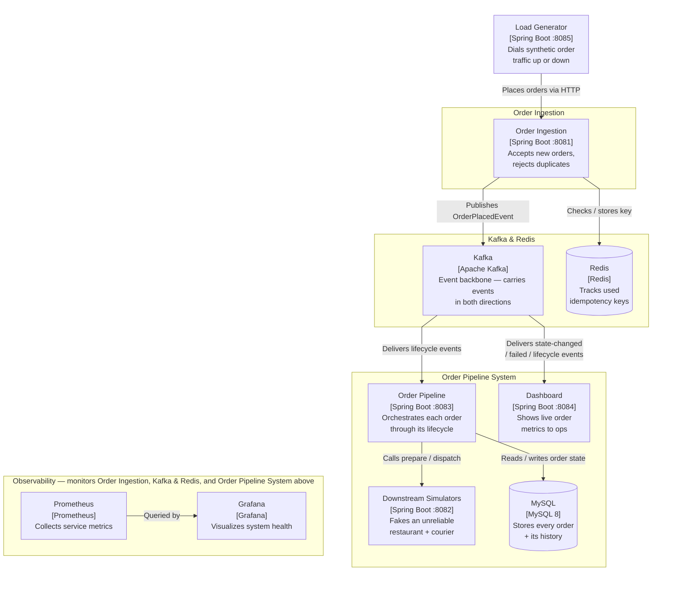
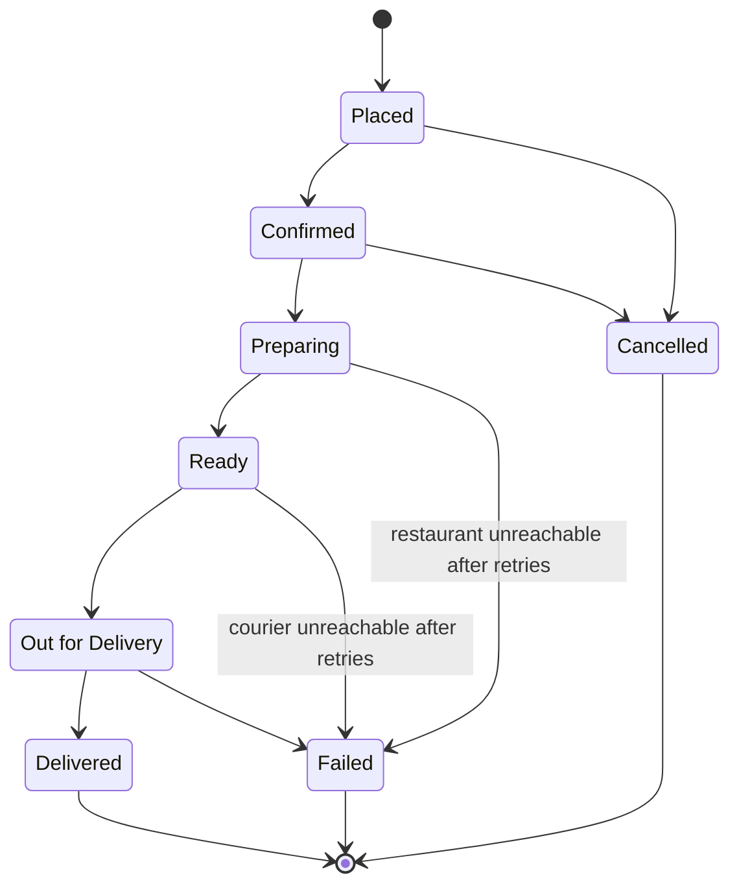

# Order Pipeline

A resilient, event-driven food-delivery order pipeline: bursty ingestion, a
flaky simulated restaurant/courier backend, a live ops dashboard, and a
load generator to cause a dinner rush on demand. This README is the single,
self-contained doc for the project — overview, architecture, design
rationale, and how to run it.

## Contents

- [What is this?](#what-is-this)
- [How it works, at a glance](#how-it-works-at-a-glance)
- [Project layout](#project-layout)
- [The life of an order](#the-life-of-an-order)
- [How correctness is guaranteed under failure](#how-correctness-is-guaranteed-under-failure)
- [Design principles](#design-principles)
- [Trade-offs — what we chose not to build, and why](#trade-offs--what-we-chose-not-to-build-and-why)
- [What's next — further enhancements & extendable features](#whats-next--further-enhancements--extendable-features)
- [Prerequisites](#prerequisites)
- [Run it](#run-it)
- [Where to look](#where-to-look)
- [Causing a dinner rush on demand](#causing-a-dinner-rush-on-demand)
- [Inducing visible failures on purpose](#inducing-visible-failures-on-purpose)
- [Idempotency in action](#idempotency-in-action)
- [Resetting for a fresh demo](#resetting-for-a-fresh-demo)

## What is this?

Imagine you run a food-delivery app. Orders come in all day, but especially
all at once during dinner rush — hundreds a minute, in bursts. Every order
has to be tracked reliably from "just placed" all the way to "delivered,"
even when the restaurant is slammed or the courier's app is glitching out.
And your operations team needs a screen they can watch, live, to see what's
actually happening across every order in flight.

This project is a working (if deliberately simplified) simulation of exactly
that backend. It can:

- **Absorb a flood of orders without falling over.** The part of the system
  that takes new orders is kept extremely simple and fast on purpose, so a
  sudden rush never becomes an outage.
- **Walk every order through its stages safely**, even when the (simulated)
  restaurant or courier is slow or unreachable — retrying automatically, and
  giving up gracefully (marking the order "Failed," never just losing it
  silently) if they truly never respond.
- **Never double-process or lose an order**, even if the same "this order
  was just placed" message accidentally gets delivered twice internally —
  a routine hazard in systems built this way.
- **Show a live view** of everything happening — how many orders are
  flowing, how many are stuck, how many failed — updating in real time with
  no page refresh.

There's no real food, restaurant, or courier here. The "restaurant" and
"courier" are simulators, deliberately built to fail and slow down at random,
so the system has something realistic to be resilient *against* — that
randomness is the whole point: it's what makes the retry logic, circuit
breakers, and failure dashboard actually mean something instead of just
being code that's never exercised.

## How it works, at a glance

Five small services, each with exactly one job, connected by a message
queue (Kafka) rather than calling each other directly:

| Service | Plain-language job |
|---|---|
| **Order Ingestion** (`:8081`) | The front door. Takes a new order, makes sure it isn't an accidental duplicate submission, and hands it off — nothing else. It never waits on the restaurant or courier, so it's never slowed down by them. |
| **Order Pipeline / Orchestrator** (`:8083`) | The kitchen manager. Picks up each order and walks it through its stages, calling the (simulated) restaurant and courier as needed, retrying if they don't answer, and marking the order "Failed" — visibly, never silently — if they never do. |
| **Downstream Simulators** (`:8082`) | Stand-ins for the real restaurant and courier systems. Randomly slow or broken on purpose, so the orchestrator has something real to be resilient against. |
| **Dashboard** (`:8084`) | The live screen a human actually watches: how many orders are moving, how many are stuck, how many failed, updating instantly. |
| **Load Generator** (`:8085`) | A dial you turn to simulate customer traffic — from "quiet afternoon" to "dinner rush" — so you can watch the rest of the system react. |

Plus three pieces of shared infrastructure:

- **Kafka** — the conveyor belt between "an order was just placed" and "the
  kitchen is working on it." It's what lets ingestion stay fast during a
  burst even though the kitchen (the orchestrator + simulators) is slower —
  orders queue up safely instead of ingestion having to wait.
- **MySQL** — the permanent record of every order and everything that ever
  happened to it.
- **Redis** — a fast, short-term memory used only to catch "have I already
  seen this exact order submission before?"

And an observability layer (Prometheus + Grafana) that watches the health of
the *machinery itself* — response times, error rates, memory — as opposed
to the Dashboard service above, which watches the *business* (orders).

This is a C4-style **container diagram** — each box is one deployable unit,
labeled with its technology and its one job; arrows describe the
interaction in a sentence rather than a bare line, and boxes are grouped
into panels by role: **Order Ingestion** on its own (the front door),
**Kafka & Redis** (the messaging/dedup infrastructure both ingestion and
the pipeline rely on), and the **Order Pipeline System** (orchestrator,
simulators, MySQL, dashboard). **Observability** sits as its own horizontal
band underneath, monitoring all three panels above it — its title says so
directly rather than drawing arrows across from each panel, since Mermaid
doesn't reliably route an arrow into a specific box that sits deep inside a
differently-laid-out panel above it — deliberately drawn separate from the
main order-flow either way, to show monitoring is a cross-cutting concern,
not another stage the order passes through. Load Generator sits outside
every panel because it's demo tooling standing in for real customer
traffic, not part of the pipeline itself.

One relationship the diagram doesn't draw as its own arrow, to avoid a
visual loop between two adjacent panels: **the pipeline publishes back to
Kafka too**, not just ingestion — every stage transition
(`OrderStateChangedEvent`) and every terminal failure
(`OrderFailedEvent`) is published *from* Order Pipeline *to* Kafka, which
is what the Dashboard's incoming arrow is actually carrying. Kafka's box
above says "carries events in both directions" for exactly this reason.



Every Spring Boot service above (Order Ingestion, Order Pipeline,
Downstream Simulators, Dashboard) also exposes `/actuator/prometheus`,
scraped by Prometheus — see [Where to look](#where-to-look) for the exact
scrape targets.

The key idea worth noticing: **ingestion never talks to the restaurant or
courier directly.** If it did, a slow restaurant would make *taking new
orders* slow too — and during a dinner rush, that's exactly backwards. Kafka
sits in between so the front door can stay fast no matter how the kitchen is
doing.

## Project layout

A Gradle multi-module build — one module per deployable service, plus a
shared "kernel" module every service depends on:

```
order-management/
├── settings.gradle, build.gradle       # root: multi-module wiring, shared repositories
├── buildSrc/
│   └── ordermgmt.spring-service.gradle # convention plugin applied to every service module:
│                                        # Java 21 toolchain, Spring Boot + Actuator +
│                                        # Micrometer-Prometheus, Lombok, shared test deps
│                                        # (JUnit 5, Testcontainers) — bump a version once here,
│                                        # every service picks it up
├── common-domain/                      # the shared kernel — deliberately dependency-free
│   │                                    # (no Spring), so depending on it never drags Spring
│   │                                    # into a module that shouldn't have it
│   └── OrderState, OrderStateMachine, OrderPlacedEvent, OrderStateChangedEvent,
│       OrderCancelRequestedEvent, OrderFailedEvent, KafkaTopics
├── order-ingestion-service/            # :8081 — the front door
├── downstream-simulators/              # :8082 — fake restaurant + courier
├── order-pipeline-service/             # :8083 — the orchestrator
├── dashboard-service/                  # :8084 — the live business view
├── load-generator/                     # :8085 — the traffic dial
└── infra/
    ├── docker-compose.yml              # single entry point: docker-compose up
    ├── reset-demo.sh                   # wipes Kafka/MySQL/Redis back to a clean slate
    ├── mysql/init.sql                  # orders + order_history schema
    ├── prometheus/prometheus.yml       # scrape config for all 5 services
    └── grafana/provisioning/           # dashboards + datasource, checked in so
                                         # `docker-compose up` yields a working Grafana
                                         # immediately — no manual clicking
```

`common-domain` being framework-free is a deliberate DRY/dependency-hygiene
choice: every service depends on the exact same order states, transition
rules, and event shapes, with zero risk of accidentally pulling Spring into
a module that has no business needing it.

## The life of an order

Every order moves through a fixed set of stages, in a fixed set of legal
directions — enforced by one single piece of code
(`OrderStateMachine`, in `common-domain`) that every other part of the
system defers to, rather than each service inventing its own rules about
"what can happen next."

| Stage | What it means |
|---|---|
| **Placed** | The customer just submitted the order. |
| **Confirmed** | The system has accepted it and is about to start on it. |
| **Preparing** | The (simulated) restaurant is working on it. |
| **Ready** | Food's ready, waiting for a courier to pick it up. |
| **Out for Delivery** | A courier has it and is on the way. |
| **Delivered** ✅ | Done. Nothing more happens to this order. |
| **Cancelled** 🚫 | The order was called off before cooking started. Nothing more happens. |
| **Failed** ⚠️ | The restaurant or courier never responded, even after several retries — the system gave up *visibly* rather than losing the order silently. Nothing more happens. |



A few things worth calling out about how this is enforced, not just diagrammed:

- **Only these arrows are legal.** An order can never jump from "Placed"
  straight to "Delivered," and it can never move backward. The orchestrator
  checks every single transition against this table before writing it, and
  logs-and-skips anything illegal instead of applying it.
- **Delivered, Cancelled, and Failed are dead ends by design** — once an
  order lands there, nothing in the system will ever move it again. That's
  what "terminal" means here.
- **"Failed" is a first-class outcome, not an error page.** When retries are
  exhausted, the order is explicitly marked Failed, written to the
  permanent record, *and* published to a separate "failed orders" channel
  (`orders.dlq`) — so a failure is something the dashboard shows and an
  operator can act on, not something that quietly vanishes.
- **Out for Delivery → Failed is defined but not currently triggered** by
  the simulated courier flow (the current simulator always eventually
  succeeds once dispatched) — it's there because the state machine models
  the legal rules of the domain, not just the paths today's simulators
  happen to exercise. It's exactly the kind of thing a real "delivery
  failed" integration would plug into without changing the rules table.

### The events and data behind the diagram

Four small, deliberately generic event types travel over Kafka — generic
because a bespoke event class per stage (`OrderConfirmedEvent`,
`OrderPreparedEvent`, ...) would mean every new stage needs a new class *and*
a new deserializer registered everywhere; one shape per *kind of thing that
happened* avoids that entirely:

| Event | Published by | Carries | Why it exists |
|---|---|---|---|
| `OrderPlacedEvent` | Ingestion, once per accepted order | order id, idempotency key, customer, items | Kicks off the pipeline. |
| `OrderCancelRequestedEvent` | Ingestion, on a cancel request | order id | A *request*, not a fact — ingestion doesn't know the order's current state (only the pipeline does), so it can only ask; the pipeline decides whether cancelling is still legal. |
| `OrderStateChangedEvent` | Pipeline, on every legal transition | order id, from-state, to-state, timestamp | One generic shape for every stage change — consumers key off `toState`, so a new stage never needs a new event class. |
| `OrderFailedEvent` | Pipeline, when retries are exhausted | order id, state it failed at, reason | Routed to its own topic (`orders.dlq`) because it has different consumers and retention needs than the main lifecycle stream. |

And what's actually persisted, in MySQL (`infra/mysql/init.sql`):

- **`orders`** — one row per order: `id`, `idempotency_key` (unique), `customer_id`,
  `state`, `version`, `created_at`, `updated_at`. That `version` column is a
  JPA optimistic-lock field — see the next section for what it's actually for.
- **`order_history`** — an append-only audit trail: `order_id`, `from_state`,
  `to_state`, `occurred_at`. Never updated, only inserted. This is what
  powers the dashboard's stuck-order detection and gives a durable record of
  every transition independent of however long Kafka happens to retain
  messages for.

## How correctness is guaranteed under failure

The single hardest requirement in a system like this isn't any individual
service — it's making sure **no order is ever silently lost or silently
processed twice**, even though messages can and will be redelivered (a
routine, expected occurrence in Kafka-based systems, not a bug). This system
handles that with two independent mechanisms, each solving a different cause
— worth understanding as two separate things, because a review that checks
only one and assumes "idempotency is handled" will miss the other:

1. **A customer (or a buggy client) submits the exact same order twice.**
   Handled at the front door: `order-ingestion-service` uses Redis's atomic
   "set this key, but only if nobody already did" operation
   (`SET key PROCESSING NX EX 24h`) keyed by the `Idempotency-Key` request
   header. The second submission finds the key already there and gets an
   immediate `409 Conflict` — it never even reaches Kafka. This is a pure
   client-retry guard; it says nothing about what happens to messages once
   they're inside the system.
2. **The same internal message gets delivered twice** — for example, a
   consumer crashes and restarts mid-batch, or a Kafka consumer-group
   rebalance replays a message that was already processed. This is not an
   edge case; it's a normal, expected occurrence in any Kafka-based system,
   and the Redis check above does nothing to prevent it (a redelivered
   message never touches ingestion again — it's already inside the
   pipeline). Handled instead with **optimistic locking**: every order row
   carries a `version` number, and before applying any transition, the
   pipeline checks that the order's *current* state still matches what the
   incoming message expects. A stale or repeated message finds the state
   has already moved on (or the version has already been bumped) and is
   logged and skipped — never blindly reapplied.

A third, smaller discipline worth naming: **every message for a given order
is published with that order's id as the Kafka partition key** — including
`OrderFailedEvent` on the DLQ topic, not just the main lifecycle events.
This is what guarantees a single order's events are always processed in the
order they happened, since Kafka only guarantees ordering *within* a
partition. Keying by anything else (a random UUID, the idempotency key)
would silently break that guarantee the moment there's more than one
partition.

## Design principles

These are standard software-design ideas — here's the plain-English version
of each, and where it concretely shows up in this codebase rather than just
being a name-drop.

| Principle | In plain English | Where it shows up here |
|---|---|---|
| **Single Responsibility** | Each part of the system does one job and has one reason to change. | Ingestion only accepts and forwards orders. The orchestrator only sequences stages. The simulators only fake unreliability. The dashboard only displays. Each is its own deployable service — you could change how orders are displayed without touching how they're processed. |
| **Open/Closed** | You should be able to add new behavior without editing existing, working code. | All the "what can happen next" rules live in one small table (`OrderStateMachine`). Adding a new stage means adding one line to that table, not hunting through multiple services for scattered `if/else` logic. |
| **Liskov Substitution / Interface Segregation** | Code should depend on a small, focused contract — not a specific implementation — so swapping the implementation is safe. | The orchestrator depends on two narrow, single-method interfaces — `RestaurantClient.prepareOrder(orderId)` and `CourierClient.dispatchOrder(orderId)` — not one bloated "downstream client" interface. It has no idea it's talking to a *simulator*; a real restaurant/courier integration could be swapped in without touching the orchestrator at all. |
| **Dependency Inversion** | High-level logic shouldn't be hard-wired to low-level details (like "how do I make an HTTP call"). | The orchestrator depends on those same two abstract interfaces, not on HTTP client code directly — which is also what makes it possible to test the orchestrator's logic with a fake restaurant/courier and no network calls at all. |
| **Don't Repeat Yourself (DRY)** | Say a thing once; don't let five copies drift apart. | One shared module (`common-domain`) holds the order states, the transition rules, and the event shapes — every service depends on the same definitions instead of five slightly-different copies. One shared build configuration is applied to every service instead of five copy-pasted ones. |
| **You Aren't Gonna Need It (YAGNI)** | Don't build machinery for a problem you don't actually have yet. | No Kubernetes manifests for a system that runs great on one machine via `docker-compose up`. No distributed-tracing backend when a correlation ID in the logs already answers "what happened to order #4821." See the trade-offs below for the full, deliberate list. |

## Trade-offs — what we chose not to build, and why

Every one of these is a conscious decision, documented here so it reads as
"chosen" rather than "missed":

- **"At least once," not "exactly once," delivery for the pipeline's own
  updates.** When the orchestrator moves an order to a new stage, it saves
  that to the database and then announces it — as two separate steps. If the
  process crashed in the exact gap between those two steps, the database
  would be right but the announcement would be missed. This is an accepted,
  narrow gap for a project at this scale — closing it fully (a pattern
  called "transactional outbox") is real, well-understood engineering work
  that wasn't justified here. **Duplicate announcements, by contrast, are
  already fully handled** — every order carries a version number, and a
  stale or repeated announcement is safely ignored rather than corrupting
  the order's state.
- **No distributed tracing backend** (tools like Zipkin or Jaeger that
  visualize a request's full journey across services). Instead, every log
  line for a given order is tagged with that order's ID, so "what happened
  to order #4821" is one log search away. That covers the "can we observe
  what happened" requirement without standing up and maintaining an entire
  additional system.
- **No authentication, API gateway, or multi-tenant support.** This is a
  single-machine demo of the order-processing plumbing, not a
  production-ready public API — adding real auth would be straightforward
  but was out of scope for what this project is demonstrating.
- **No horizontal auto-scaling / Kubernetes.** The ingestion service is
  intentionally stateless specifically so it *could* be scaled out
  trivially (e.g. `docker-compose up --scale`) — but standing up a full
  Kubernetes cluster with autoscaling rules wasn't necessary to prove that
  point for a local demo.
- **A minimal, framework-free dashboard frontend** (plain HTML/CSS/JS, no
  React or build toolchain) rather than a polished single-page app. It does
  everything the demo needs — live updates, no manual refresh — without the
  overhead of a frontend build pipeline for a project this size.
- **No payment processing, pricing engine, or real restaurant/courier
  integrations.** This project is about the order-lifecycle plumbing —
  intake, sequencing, resilience, observability — not a full commerce
  platform.

## What's next — further enhancements & extendable features

Ideas for where this could grow, roughly in the order they'd matter for a
real production system — several of these are natural extensions of design
decisions already made above, not bolt-ons that would require a rewrite:

- **Close the "at least once" gap** with a transactional outbox — write the
  state change and the announcement in the same database transaction,
  relayed to Kafka afterward, so a crash can never lose an announcement.
- **Swap the simulators for real integrations.** Because the orchestrator
  only depends on those two narrow `RestaurantClient`/`CourierClient`
  interfaces (see Dependency Inversion above), plugging in a real restaurant
  point-of-sale system or courier-dispatch API means writing one new
  implementation of each interface — the orchestrator, the state machine,
  and the dashboard don't change at all.
- **Distributed tracing** (OpenTelemetry + a backend like Tempo or Jaeger)
  for a visual, click-through view of a single order's journey across every
  service — a natural upgrade from today's log-correlation-ID approach once
  the system has enough services to make that visualization worth the
  operational cost of running it.
- **Horizontal scaling with Kubernetes**, including autoscaling ingestion
  under load — the stateless design already makes this possible; this
  would be about operationalizing it, not re-architecting for it.
- **Alerting**, not just dashboards — Prometheus Alertmanager rules so an
  on-call human gets paged when the DLQ rate or stuck-order count crosses a
  threshold, instead of relying on someone watching Grafana.
- **A customer-facing order-status/history API** — today's data model
  (every order, every stage transition, with timestamps) already has
  everything needed for this; it's a new read-only API on top of existing
  data, not a new data model.
- **Backpressure signaling** — today ingestion always accepts and queues;
  a richer version could signal "we're overloaded, retry in N seconds"
  back to callers under extreme load rather than queuing indefinitely.
- **Scheduled/automated chaos campaigns** — building on the existing live
  `/chaos/config` control lever to run scripted chaos scenarios
  (e.g. "ramp 503s from 0% to 80% over 5 minutes") for repeatable resilience
  testing instead of manual demo-time tuning.
- **A richer dashboard frontend** (React/Vue, more chart types, historical
  trend views beyond the current rolling window) if the audience for this
  demo grows beyond "watch it live during a walkthrough."
- **Payments, pricing, multi-restaurant/multi-region support, auth** — the
  actual features that would turn this from an order-pipeline demonstration
  into a real product; deliberately out of scope today (see trade-offs
  above), but the event-driven backbone here doesn't preclude any of them.

## Prerequisites

* JDK 21 (only needed to *build* the jars — the containers run on a JRE base image)
* Docker + Docker Compose

## Run it

```bash
# 1. Build all service jars (from the repo root)
./gradlew build          # gradlew.bat build on Windows

# 2. Bring up the whole system — infra + all five app services
cd infra
docker-compose up --build -d
```

`docker-compose up` is the single entry point for everything: MySQL, Redis,
Kafka, Prometheus, Grafana, and all five application services. Rebuilding
after a code change: re-run `./gradlew build` then
`docker-compose up --build -d` again (Docker only rebuilds the images whose
jar actually changed).

Check everything is healthy:

```bash
docker-compose ps
```

Tear down:

```bash
docker-compose down -v   # -v also drops the mysql/kafka data volumes
```

## Where to look

| What | URL |
|---|---|
| **Live business dashboard** | http://localhost:8084 |
| Grafana (system health) | http://localhost:3000 (admin/admin) |
| Prometheus | http://localhost:9090 |
| Order ingestion API | http://localhost:8081/api/orders |
| Load generator control API | http://localhost:8085/load/* |
| Downstream simulators (restaurant/courier) | http://localhost:8082 |
| Order pipeline / orchestrator | http://localhost:8083 |

Every service also exposes `/actuator/health` and `/actuator/prometheus`.

## Causing a dinner rush on demand

The load generator starts at a quiet baseline (2 orders/sec by default) and
posts continuously to the ingestion API. To demo the rush:

> **Windows PowerShell users:** two gotchas, both worked around below.
> First, call `curl.exe` explicitly, not bare `curl` — PowerShell aliases
> `curl` to `Invoke-WebRequest`, which binds `-H` to its own `-Headers`
> parameter (expecting a hashtable, not a string) and fails with
> `Cannot bind parameter 'Headers'`. Second, when PowerShell forwards a
> single-quoted `'{"key": value}'` string to a native exe like `curl.exe`,
> it silently strips the embedded double quotes, corrupting the JSON body
> — escape them with `\`"` inside a double-quoted string instead.

```bash
# Steady baseline
curl -X POST http://localhost:8085/load/rate -H "Content-Type: application/json" -d '{"ordersPerSecond": 2}'

# Steady baseline capped at a total of 500 orders — auto-stops itself once
# that many have been submitted, so a demo can't be left running forever
curl -X POST http://localhost:8085/load/rate -H "Content-Type: application/json" -d '{"ordersPerSecond": 5, "maxOrders": 50}'

# Cause a burst: 10x the current baseline for 60 seconds
curl -X POST http://localhost:8085/load/burst -H "Content-Type: application/json" -d '{"multiplier": 10, "durationSeconds": 60}'

# Check current rate (also reports maxOrders and ordersSubmitted so far, if a cap is set)
curl http://localhost:8085/load/status

# Stop generating load entirely
curl -X POST http://localhost:8085/load/stop
```

```powershell
# Steady baseline
curl.exe -X POST http://localhost:8085/load/rate -H "Content-Type: application/json" -d "{\`"ordersPerSecond\`": 2}"

# Steady baseline capped at a total of 500 orders — auto-stops itself once
# that many have been submitted, so a demo can't be left running forever
curl.exe -X POST http://localhost:8085/load/rate -H "Content-Type: application/json" -d "{\`"ordersPerSecond\`": 5, \`"maxOrders\`": 50}"

# Cause a burst: 10x the current baseline for 60 seconds
curl.exe -X POST http://localhost:8085/load/burst -H "Content-Type: application/json" -d "{\`"multiplier\`": 10, \`"durationSeconds\`": 60}"

# Check current rate (also reports maxOrders and ordersSubmitted so far, if a cap is set)
curl.exe http://localhost:8085/load/status

# Stop generating load entirely
curl.exe -X POST http://localhost:8085/load/stop
```

`maxOrders` is optional — omit it for unbounded generation (the previous
behavior). When set, it applies to whatever rate is active, baseline or
burst, and each new `/load/rate` call defines a fresh cap (it doesn't
accumulate across calls).

Watch http://localhost:8084 update live as the burst hits — active order
count and throughput should spike, and (depending on the simulators'
current chaos settings) the failed/DLQ tile and stuck-order count should
move too.

## Inducing visible failures on purpose

The downstream simulators inject latency/503/429 failures on every
restaurant/courier call. Two ways to control the rates:

### Dynamically, without a restart (recommended)

`POST /chaos/config` dials the failure/latency profile up or down on the
running container — takes effect on the very next request, no restart:

```bash
# Crank 503s up to 90% — enough to force the pipeline's circuit breaker open
curl -X POST http://localhost:8082/chaos/config -H "Content-Type: application/json" -d '{"latencyProbability": 0.2, "rate503": 0.9, "rate429": 0.0}'

# Check the current live config
curl http://localhost:8082/chaos/config

# Calm it back down
curl -X POST http://localhost:8082/chaos/config -H "Content-Type: application/json" -d '{"latencyProbability": 0.2, "rate503": 0.15, "rate429": 0.10}'
```

```powershell
# Same curl.exe / escaped-quote gotchas as the load generator commands above apply here too
curl.exe -X POST http://localhost:8082/chaos/config -H "Content-Type: application/json" -d "{\`"latencyProbability\`": 0.9, \`"rate503\`": 0.0, \`"rate429\`": 0.0}"
curl.exe http://localhost:8082/chaos/config
curl.exe -X POST http://localhost:8082/chaos/config -H "Content-Type: application/json" -d "{\`"latencyProbability\`": 0.2, \`"rate503\`": 0.15, \`"rate429\`": 0.10}"
```

All three fields are required on `POST` (it's a full replace, not a
partial patch) and each must be between `0.0` and `1.0`. Latency min/max
bounds (3-5 seconds by default) aren't tunable here — they're a
startup-time concern, set only via the environment variables below.

### At startup, via environment variables

The container's *default* profile when it (re)starts comes from
`chaos.latency.probability`, `chaos.rate503`, `chaos.rate429`, and the
latency min/max bounds in
`downstream-simulators/src/main/resources/application.yml` (currently
`0.20` latency probability, `0` for both `rate503` and `rate429` unless
overridden). Override the corresponding `CHAOS_*` environment variables on
the `downstream-simulators` service in `infra/docker-compose.yml` and
restart it to change what it starts up with next time — useful for making
a new default stick across restarts, but for a live demo `/chaos/config`
above is faster and doesn't drop in-flight connections.

## Idempotency in action

The load generator occasionally (≈3% of requests) deliberately replays a
recently used `Idempotency-Key`, so you should see a steady trickle of
`409 Conflict` responses counted in the `loadgen_orders_duplicate_rejected_total`
metric — proof the dedup path is live, not just implemented. This is also why
a `maxOrders` cap (see "Causing a dinner rush on demand" above) can land
slightly below the number you asked for: `maxOrders` counts requests the load
generator *dispatched*, not orders the pipeline actually *accepted*, and a
409-rejected duplicate never reaches Kafka/the pipeline at all.

The live business dashboard (http://localhost:8084) surfaces this directly —
below the main order tiles, an "Accepted / Duplicate (409) / Errors" row
shows the load generator's own submission counters live, polled every
`ordermgmt.dashboard.heartbeat-ms` (2s by default) so you can see exactly
where the difference between "submitted" and "placed" is coming from without
cross-referencing Grafana or `/load/status`.

## Resetting for a fresh demo

Letting the load generator run for a while (or forgetting to undo a burst)
can leave the pipeline well behind — Kafka carrying a large backlog, MySQL
full of old orders, Redis full of used idempotency keys. Stopping the load
generator (`/load/stop`) only stops *new* orders from being produced; the
pipeline will keep draining whatever's still queued in Kafka, so the
dashboard can look like orders are still being placed for a while after you
"stopped" it. To wipe everything back to zero before a demo, run the script:

```bash
cd infra
./reset-demo.sh              # reset only
./reset-demo.sh --with-load  # reset, then also restart the load generator
```

Or, if you'd rather run the steps by hand (also what the script itself does):

```bash
# 1. Stop generating new load
curl -X POST http://localhost:8085/load/stop

cd infra

# 2. Stop the services that produce/consume Kafka messages and hold state
#    (leave kafka, mysql, redis, prometheus, grafana running)
docker-compose stop order-ingestion-service order-pipeline-service dashboard-service load-generator

# 3. Delete the Kafka topics — this clears out any backlog. They're
#    auto-created again (with the configured 6 partitions) the moment a
#    producer/consumer touches them once the services below restart.
docker exec ordermgmt-kafka kafka-topics --delete --topic orders.lifecycle --bootstrap-server kafka:9092
docker exec ordermgmt-kafka kafka-topics --delete --topic orders.dlq --bootstrap-server kafka:9092

# 4. Delete the now-stale consumer group offsets
docker exec ordermgmt-kafka kafka-consumer-groups --delete --group order-pipeline-service --bootstrap-server kafka:9092
docker exec ordermgmt-kafka kafka-consumer-groups --delete --group dashboard-service --bootstrap-server kafka:9092

# 5. Clear MySQL — orders and their history
docker exec ordermgmt-mysql mysql -uordermgmt -pordermgmt orders -e "TRUNCATE TABLE order_history; TRUNCATE TABLE orders;"

# 6. Clear Redis — used idempotency keys (Redis is dedicated to this system, safe to flush)
docker exec ordermgmt-redis redis-cli FLUSHALL

# 7. Bring the app services back up
docker-compose start order-ingestion-service order-pipeline-service dashboard-service

# 8. (optional) Start the load generator again once you're ready to demo
docker-compose start load-generator
```

After step 7, http://localhost:8084 should show every tile at 0 and an empty
state distribution — a clean slate. Then kick off load whenever you're ready,
either by starting the load generator (step 8) or with the `/load/rate` /
`/load/burst` commands from "Causing a dinner rush on demand" above.
